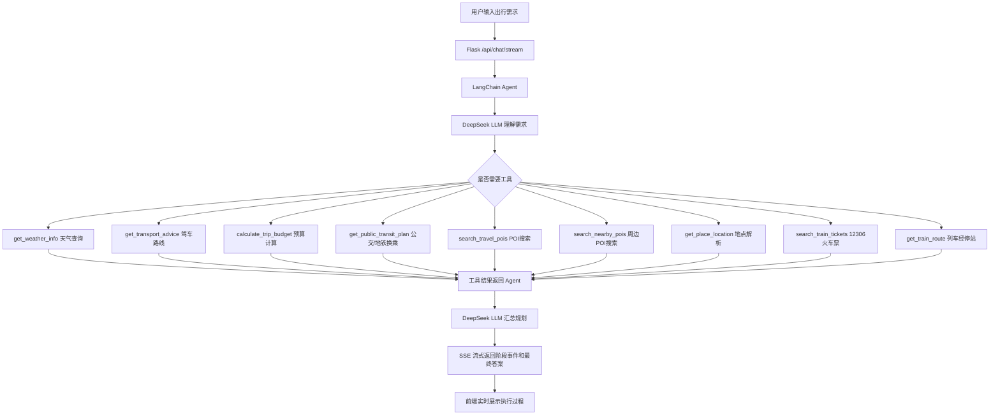

# LangChain 旅游出行规划智能体

这是一个围绕“智能体架构与开发流程”实验要求完成的课程项目。项目基于 Python、Flask、LangChain 和 DeepSeek API，实现了一个旅游出行规划 Agent。它可以理解用户需求、拆解任务、调用 LLM、按需调用外部工具、汇总工具结果，并通过网页界面输出完整行程方案。

项目参考了本地下载网页《【LangChain+文心大模型】构建旅游出行规划智能体 - 飞桨AI Studio星河社区》，但当前实现已经扩展为带 Web UI、多轮会话持久化和流式工具调用可视化的版本。

## 接手总览（2026-05-14）

当前项目已经从课程实验 Demo 扩展为一个可演示的旅游规划 Agent Web 应用。核心闭环已经跑通：用户自然语言输入出行需求，LangChain Agent 调用 DeepSeek 模型分析需求，并按需调用天气、路线、POI、地点解析、预算计算等工具，最后通过 Web UI 输出 Markdown 方案和结构化卡片。

当前服务状态：

- Flask 服务可能仍在运行，若 `127.0.0.1:5000` 无响应，用以下命令启动：

```powershell
C:\Users\BaoXinJie\anaconda3\python.exe app.py
```

当前 `.env` 已配置：

- DeepSeek API：普通模式 `deepseek-v4-flash`，深度思考模式 `deepseek-v4-pro`
- 高德地图 Web 服务 Key：用于地点解析、POI 搜索、路线距离、天气回退
- 和风天气 API Key + 专属 API Host：用于实时天气和 3 日预报

注意：`.env` 包含真实密钥，不要提交到公开仓库，也不要在后续回答中完整打印。

已完成阶段：

1. **Phase 0：实验基础版**
   - Python + LangChain + DeepSeek Agent
   - 天气、交通、预算工具
   - CLI 和 Flask Web 两种入口

2. **Phase 1：结构化输出与前端卡片**
   - Agent 在最终回答末尾输出 JSON
   - 后端提取为 `structured_data`
   - 前端渲染天气卡片、交通卡片、预算卡片、每日行程时间轴和提示列表
   - 原始 JSON 不直接展示给用户

3. **Phase 2：Agent 执行时间轴**
   - SSE 实时返回 Agent 阶段事件
   - 运行中 trace 自动展开，完成后自动折叠
   - 每步显示状态、相对时间、耗时和异常高亮
   - 支持前端“停止”当前请求
   - 支持导出 Agent 执行报告 JSON

4. **Phase 3 完整版：POI 结构化与真实火车票**
   - 高德地图：地理编码、POI 搜索、驾车路线、距离/耗时/过路费估算、天气回退
   - 和风天气：已支持专属 Host 鉴权方式，配置齐全后优先使用；已验证可用
   - Open-Meteo：作为最终天气回退
   - **POI 结构化卡片**（2026-05-14 完成）：Agent 提示词要求至少调用 3 次 search_travel_pois（景点/餐饮/商圈），结果填入 structured JSON `poi_recommendations` 字段，前端渲染为分类 POI 推荐卡片网格
   - **12306 火车票查询**（2026-05-14 完成）：接入第三方 [12306-mcp](https://github.com/Joooook/12306-mcp.git) MCP Server，通过自写 Python MCP stdio 客户端跨进程通信。新增 `search_train_tickets`（余票查询，支持高铁/动车/普速筛选）和 `get_train_route`（车次经停站）两个 LangChain 工具。零新增 Python 依赖，Node.js 不可用时自动降级
   - Agent 提示词已要求在跨城出行时必须调用 search_train_tickets 获取真实车次数据，不得凭通用建议编造

2026-05-14 下午复查与修复：

- 修复 DeepSeek 接手后留下的 12306 阻塞风险：原实现会在 `build_agent()` 时启动 `npx 12306-mcp`，导致任意普通请求都可能被 MCP 下载或初始化卡住。现在只检测 `npx` 是否存在并注册工具，真正调用 `search_train_tickets` / `get_train_route` 时才启动 MCP。
- 修复 MCP stdout 读取可能无限阻塞的问题：改为后台线程读取 stdout + queue 超时等待，请求超时会返回明确错误。
- MCP 子进程异常退出后，下次工具调用会重新尝试连接，不再永久持有失效客户端。
- 高德 POI 查询已从 `extensions=base` 升级为 `extensions=all`，工具会尽量返回评分、人均、营业时间、照片链接等扩展字段。
- 前端 POI 卡片已支持展示 `rating`、`cost`、`tel`、`location`、`photo_url` 等可选信息。
- 运行状态面板新增 `12306` 状态，显示本机是否检测到 Node/npx。

2026-05-14 Phase 3 继续完善：

- 新增 `get_public_transit_plan` 工具：基于高德 `/direction/transit/integrated` 查询公交/地铁换乘方案，可返回耗时、步行距离、费用和主要换乘线路。适合车站到酒店、酒店到景点、景点到景点等城市内移动场景。
- 新增 `search_nearby_pois` 工具：基于高德 `/place/around` 按中心地点和半径查询周边 POI，可用于“西湖附近餐饮”“杭州东站附近酒店”“景点附近地铁站”等更精确的推荐。
- Agent 提示词已更新：城市内移动优先调用 `get_public_transit_plan`；地点周边推荐优先调用 `search_nearby_pois`；全城级目的地推荐继续使用 `search_travel_pois`。
- 已完成工具级烟测：`杭州东站 -> 西湖` 可返回地铁换乘方案；`西湖` 周边餐饮可返回距离、评分、人均和照片链接。
- 当前不需要额外申请新 API；这两个能力复用现有高德地图 Web 服务 Key。
- 新增 `get_air_quality_info` 和 `get_weather_alerts`：复用和风天气 Host/Key 查询空气质量和灾害预警。当前本地和风账号对这两个接口返回 403，工具已做成“暂不可用”降级，不会把 Agent 流程标成失败。
- 新增 `get_map_marker_link`：生成无 Key 泄露风险的高德地图 URI 标记链接，前端 POI 卡片支持渲染 `map_url`。
- 新增 `search_interline_train_tickets`：封装 12306-MCP 的 `get-interline-tickets` 中转余票查询，已通过 `宁波 -> 张家界` 中转方案烟测。
- 新增 `search_flight_options`：接入 Aviationstack 航班时刻/状态查询，支持常见城市名自动映射机场三字码。已通过 `上海虹桥 -> 北京首都`、`宁波 -> 广州` 航班查询烟测。注意：该接口不提供机票价格。
- 本轮继续完善 Phase 3：新增 `get_walking_route`、`get_bicycling_route`、`get_route_distance_matrix`，进一步复用高德步行路线、骑行路线、距离测量能力。
- 修复 Aviationstack 免费层 HTTPS 403 问题：航班查询端点改为 HTTP；`宁波 -> 广州` 已验证可返回近期/实时航班结果。
- Agent 提示词新增“单点查询”规则：用户只要求查航班、火车、天气、公交、地点或周边时，只回答对应主题，不再自动扩展成完整旅行方案。
- 继续完善交通展示体验：`transport_options` 支持 `category`、`data_source`、`status`、`departure_time`、`arrival_time`、`legs` 等可选字段，前端交通卡片会自动识别航班、火车、中转火车、公交地铁、步行、骑行、驾车。
- 12306 中转方案前端卡片化：当 JSON 中含 `legs` 或 `category=interline_train` 时，前端会把每一段车次渲染为分段小卡片，展示车次、起终点、时间、耗时、票价/余票和备注。
- 单点查询体验继续收敛：提示词明确要求航班/火车/天气/公交/地点/周边等查询只输出相关小节，JSON 也只填相关字段。
- 执行过程可读性优化：前端将原始工具函数名映射为“查询航班 / 查询天气预警 / 规划公交地铁 / 查询中转火车”等用户可读阶段，并展示关键参数标签，原始参数折叠保留用于调试。
- 天气预警卡片：结构化 JSON 新增 `weather_alerts` 字段，前端支持按红/橙/黄/蓝/无预警/不可用状态渲染天气预警卡片。

建议下一位接手者优先做：

- 补充 pytest 测试：工具层 mock 测试（天气/POI/火车票）、SSE 离线模式测试、SQLite 持久化测试、train_tools MCP 客户端 mock 测试。
- 继续增强 POI 体验：增加排序/筛选、按行程日关联推荐、嵌入高德静态地图。
- 公交/地铁路线规划已完成基础接入：后续可继续增强换乘排序、首末班时间解释和步行距离偏好。
- 高德周边搜索已完成基础接入：后续可继续增强排序/筛选、按行程日关联推荐和静态地图展示。
- 和风天气增强：空气质量和天气预警工具已接入；若账号开通对应权限即可返回真实数据。
- 前端 POI 卡片继续增加排序/筛选功能，并嵌入高德静态地图。
- 12306 中转查询已完成；后续可做前端中转方案卡片展示。

## 当前状态

已完成：

- LangChain Agent 主流程
- DeepSeek OpenAI-compatible API 接入
- 普通模式使用 `deepseek-v4-flash`
- 深度思考模式使用 `deepseek-v4-pro`
- 天气、空气质量、天气预警、预算、驾车路线、航班、公交/地铁、步行、骑行、距离矩阵、POI、地图链接和 12306 等 17 个工具
- Flask Web 聊天界面
- Markdown 渲染为标题、列表、表格
- SQLite 服务端历史会话持久化
- 刷新页面后恢复历史聊天
- 流式 Agent 执行过程展示
- 运行中自动展开执行过程，完成后自动折叠
- 执行过程显示每步状态、相对时间、耗时和异常高亮
- 生成中可点击“停止”中断当前前端请求
- 支持导出 Agent 执行报告 JSON
- 每轮回复保存模型、模式、耗时和 trace 元数据
- 高德地图真实数据源：地点解析、POI 搜索、驾车路线、距离/耗时/费用估算、天气回退
- 和风天气真实数据源：支持 API Key + 专属 API Host 鉴权方式，优先查询实时天气和 3 日预报；已验证可用
- **结构化 JSON 输出 + 前端卡片渲染**（Phase 1）：Agent 在 Markdown 末尾输出 JSON 代码块，后端提取为 `structured_data`，前端渲染为天气卡片、每日行程时间轴、交通方案卡、预算明细卡和出行提示列表；原始 JSON 不直接展示给用户
- **POI 推荐卡片**（Phase 3）：Agent 至少调用 3 次 `search_travel_pois`（景点/餐饮/商圈），结果填入 `poi_recommendations` 字段，前端渲染为分类 POI 推荐卡片网格（类型标签 + 名称 + 地址 + 可选评分/人均/电话/坐标/图片）
- **交通结果卡片化增强**（Phase 3）：前端可识别航班、火车、中转火车、公交地铁、步行、骑行、驾车等交通类型；中转方案支持 `legs` 分段展示。
- **执行过程可读化**（Phase 3）：运行中的 trace 不再只展示工具函数名，改为用户可理解的阶段名称，并用参数标签展示正在查什么。
- **天气预警卡片**（Phase 3）：`weather_alerts` 字段可渲染独立预警卡片，支持无预警、接口不可用和不同预警等级样式。
- **12306 火车票查询**（Phase 3）：接入第三方 12306-mcp MCP Server（Node.js），通过自写 Python MCP stdio 客户端跨进程通信。新增 `search_train_tickets`、`search_interline_train_tickets` 和 `get_train_route` 三个 LangChain 工具，支持余票查询、中转方案和经停站时刻表。零新增 Python 依赖，Node.js 不可用时自动降级。Agent 跨城出行时必须调用该工具获取真实车次数据。当前已修复为“工具调用时懒启动 MCP”，避免普通请求被 12306 初始化拖慢
- 当前共 17 个 LangChain 工具：天气、空气质量、天气预警、预算、驾车路线、航班查询、公交/地铁换乘、步行路线、骑行路线、距离矩阵、全城 POI 搜索、周边 POI 搜索、地点解析、地图链接、火车票查询、火车中转查询、列车经停站

当前适合：

- 课程实验验收
- 本地演示 LangChain Agent 工作流
- 继续扩展成简历项目

## 项目目标

实验要求中的智能体闭环：

```text
理解需求 -> 拆解任务 -> 调用 LLM 思考 -> 选择工具 -> 执行工具 -> 汇总结果 -> 输出规划
```

本项目对应实现：

- 用户输入自然语言出行需求。
- LLM 判断目的地、出发地、天数、人数、预算和偏好。
- Agent 自主决定是否调用天气、交通、预算工具。
- 工具返回后，LLM 汇总生成中文旅行规划。
- 前端实时展示 Agent 运行阶段，让用户知道请求已经发出、模型正在工作、工具是否被调用。
- 对于真实旅行规划，Agent 会优先使用高德地图和和风天气补充地点、路线、天气和 POI 数据。

## 技术栈

- 编程语言：Python
- 本机解释器：`C:\Users\BaoXinJie\anaconda3\python.exe`
- Web 框架：Flask
- 智能体框架：LangChain
- LLM 接入：`langchain-openai` 的 OpenAI-compatible 接口
- 模型平台：DeepSeek
- 地图与 POI 数据：高德地图 Web 服务 API
- 天气数据：和风天气；高德天气和 Open-Meteo 作为回退
- 前端：原生 HTML、CSS、JavaScript
- 历史记录：SQLite
- 流式通信：SSE，接口为 `/api/chat/stream`

选择 Python 的原因：LangChain 的 Python 生态最成熟，Agent、工具封装、模型接入和实验资料都更完整。

## 项目结构

```text
.
├── app.py                         # Flask 启动入口，导入 web.py 中的 app
├── web.py                         # Flask 路由、聊天接口、SSE 流式接口
├── run.py                         # 命令行入口
├── requirements.txt               # Python 依赖
├── .env.example                   # 环境变量模板
├── README.md                      # 当前说明文档
├── EXPERIMENT_REPORT.md           # 实验报告草稿/说明
├── data/
│   └── travel_agent.db            # SQLite 数据库，运行后自动生成
├── static/
│   ├── app.js                     # 前端交互、SSE 读取、Markdown 渲染、历史会话
│   └── styles.css                 # 页面样式
├── templates/
│   └── index.html                 # Web 页面模板
└── src/
    └── travel_agent/
        ├── __init__.py
        ├── agent.py               # LangChain Agent、提示词、trace 提取、流式事件
        ├── cli.py                 # CLI 参数解析
        ├── config.py              # .env 配置读取
        ├── storage.py             # SQLite 会话和消息持久化
        ├── tools.py               # 天气、预算、交通、POI、地点解析工具
        └── train_tools.py         # 12306 火车票 MCP 客户端及 LangChain 工具（可选）
```

## 环境配置

推荐使用用户本地 PyCharm 同款解释器：

```powershell
C:\Users\BaoXinJie\anaconda3\python.exe
```

安装依赖：

```powershell
C:\Users\BaoXinJie\anaconda3\python.exe -m pip install -r requirements.txt
```

复制环境变量模板：

```powershell
Copy-Item .env.example .env
```

`.env` 需要包含：

```text
LLM_API_KEY=你的 DeepSeek API Key
LLM_BASE_URL=https://api.deepseek.com
LLM_MODEL=deepseek-v4-flash
LLM_THINKING_MODEL=deepseek-v4-pro
LLM_TEMPERATURE=0.3
LLM_TIMEOUT=90
AMAP_API_KEY=你的高德地图 Web 服务 Key
QWEATHER_API_KEY=你的和风天气 API Key
QWEATHER_API_HOST=你的和风天气专属 API Host
AVIATIONSTACK_API_KEY=你的 Aviationstack API Key
```

注意：`.env` 不应提交到公开仓库。当前本地 `.env` 已填写 DeepSeek、高德地图、和风天气、Aviationstack Key 以及和风天气专属 Host。和风天气如果失效，项目会自动使用高德天气或 Open-Meteo 回退。

## 运行方式

启动 Web 界面：

```powershell
C:\Users\BaoXinJie\anaconda3\python.exe app.py
```

浏览器打开：

```text
http://127.0.0.1:5000
```

命令行普通模式：

```powershell
C:\Users\BaoXinJie\anaconda3\python.exe run.py -q "我明天从郑州去杭州，玩3天，2个人，酒店300，餐饮120，门票300"
```

命令行深度思考模式：

```powershell
C:\Users\BaoXinJie\anaconda3\python.exe run.py --thinking -q "我明天从郑州去杭州，玩3天，2个人，酒店300，餐饮120，门票300"
```

离线演示模式：

```powershell
C:\Users\BaoXinJie\anaconda3\python.exe run.py --offline-demo -q "我明天从郑州去杭州，玩3天"
```

离线演示不调用 LLM，只用于验证工具链和页面流程。正式展示建议关闭离线演示，使用真实 DeepSeek API。

## Web 功能说明

页面包含：

- 左侧运行状态：普通模型、思考模型、API Key 状态
- 左侧数据源状态：高德地图、和风天气、12306 运行环境
- 左侧历史会话：新建、切换、删除
- 主聊天区：用户输入和助手回复
- 输入区开关：深度思考、离线演示
- 回复下方元信息：模式、模型、耗时
- 回复下方执行过程：工具调用 trace

当前 UI 的重点不是华丽，而是让用户清楚看到 Agent 确实在运行：

- 请求刚发出时显示“请求已接收”
- 模型启动时显示使用的模型
- 调用工具时实时显示工具名和参数
- 工具返回后显示结果摘要
- 模型阶段完成时显示 token usage
- trace 中展示每个阶段的 `running` / `success` / `error` 状态
- 工具调用返回后展示该步骤耗时，异常结果会高亮
- 运行中 trace 自动展开
- 最终回答生成后 trace 自动折叠
- 生成过程中发送按钮会变为“停止”，可中断当前前端流式请求
- 历史回复中的 trace 可导出为 JSON 执行报告

## Agent 架构



## 核心模块说明

### `src/travel_agent/agent.py`

负责：

- 构建 LangChain Agent
- 定义系统提示词
- 区分普通模式和深度思考模式
- 构建多轮消息上下文
- 从历史消息中提取轻量记忆摘要
- 非流式运行：`run_agent_with_trace`
- 流式运行：`stream_agent_events`
- 提取工具调用 trace

重要设计：

- 普通模式使用 `.env` 的 `LLM_MODEL`
- 深度思考模式使用 `.env` 的 `LLM_THINKING_MODEL`
- 用户询问模型身份时，提示词要求按当前配置回答，避免模型自称 Claude 等无关身份
- DeepSeek API-level thinking 被关闭，原因见下文“重要注意事项”

### `src/travel_agent/tools.py`

当前 14 个核心工具：

- `get_weather_info(city, date)`：优先调用和风天气（API Key + Host 鉴权）；未配置和风 Host 时使用高德天气；再失败时回退 Open-Meteo
- `get_air_quality_info(city)`：和风空气质量查询；当前账号未开通时会返回“暂不可用”而非阻断流程
- `get_weather_alerts(city)`：和风天气灾害预警查询；当前账号未开通时会返回“暂不可用”而非阻断流程
- `get_transport_advice(origin, destination)`：仅提供**驾车路线**数据（高德地图：距离、耗时、过路费估算）。注意：此工具不包含火车票信息，火车票必须使用 `search_train_tickets`
- `search_flight_options(departure, arrival, date, airline, flight_number, limit)`：调用 Aviationstack 查询航班时刻/状态，支持常见城市名自动映射机场三字码；不提供机票价格
- `get_public_transit_plan(origin, destination, origin_city, destination_city, limit)`：调用高德地图查询公交/地铁换乘方案，返回耗时、步行距离、费用和主要线路
- `get_walking_route(origin, destination, city)`：调用高德地图查询步行路线，返回距离、耗时和主要步行步骤
- `get_bicycling_route(origin, destination, city)`：调用高德地图查询骑行路线，适合市内短途或共享单车方案比较
- `get_route_distance_matrix(origins, destination, city, travel_type)`：调用高德距离测量 API，比较多个出发点到同一目的地的距离/耗时
- `calculate_trip_budget(...)`：按人数、天数、酒店、餐饮、门票计算预算
- `search_travel_pois(city, keyword, limit)`：调用高德地图搜索景点、餐饮、商圈、酒店等 POI
- `search_nearby_pois(place, city, keyword, radius, limit)`：调用高德地图周边搜索，围绕景点、车站或酒店按半径查询餐饮、住宿、地铁站等 POI
- `get_place_location(place, city)`：调用高德地图核验地点地址和经纬度
- `get_map_marker_link(place, city)`：生成高德地图地点标记 URI，不暴露 API Key

工具会在控制台输出调用日志，便于实验展示和调试。

### `src/travel_agent/train_tools.py`

12306 火车票查询（可选工具，需 Node.js + npx）：

- `_McpClient` 类：自写 Python MCP stdio 客户端。通过 `subprocess.Popen` 启动 `npx 12306-mcp`，JSON-RPC over stdin/stdout 通信。含子进程生命周期管理、stderr 后台排空、初始化握手
- `search_train_tickets(date, from_city, to_city, train_filter_flags, limit)`：查询 12306 余票，返回车次号、出发/到达时刻、历时、各座型余票和票价。支持按高铁(G)/动车(D)/普速等筛选
- `get_train_route(train_code, date)`：查询特定车次的详细经停站和时刻表

设计要点：

- **可选依赖**：`get_train_tools()` 检测 npx 可用性；Node.js 不可用时返回空列表，不阻塞 Agent 启动
- **零新增 Python 依赖**：仅用 `subprocess` + `json` + `shutil` + `threading` + `queue` 标准库
- `search_interline_train_tickets(date, from_city, to_city, middle_city, train_filter_flags, limit)`：查询 12306 中转余票方案
- 工具列表动态组合：`build_agent` 中 `TRAVEL_TOOLS + get_train_tools()` → 最多 17 个工具
- **懒启动 MCP**：`get_train_tools()` 只检测 `npx` 并注册工具，不启动 `12306-mcp`；真正调用火车票工具时才启动 MCP，避免普通问题被 12306 初始化拖慢
- **超时保护**：MCP stdout 使用后台线程 + queue 等待，避免阻塞式 `readline()` 无限卡住

### `src/travel_agent/storage.py`

负责 SQLite 持久化：

- `conversations` 表保存会话
- `messages` 表保存用户和助手消息
- `meta_json` 保存模型、模式、耗时、trace

数据库路径：

```text
data/travel_agent.db
```

### `web.py`

主要接口：

- `GET /`：页面
- `GET /api/status`：读取模型和 API Key 状态
- `GET /api/conversations`：会话列表
- `GET /api/conversations/<id>/messages`：读取会话消息
- `DELETE /api/conversations/<id>`：删除会话
- `POST /api/chat`：非流式聊天接口，保留兼容
- `POST /api/chat/stream`：当前前端使用的 SSE 流式聊天接口

### `static/app.js`

负责：

- 发送用户消息
- 读取 SSE 流式事件
- 实时更新 loading 消息
- 渲染 Markdown
- 渲染 trace 折叠面板
- 维护当前 `conversation_id`
- 加载、切换、删除历史会话

## 深度思考模式说明

用户原始理解是：深度思考模式应该让智能体“思考更长时间再回答”。

当前实现方式：

- 普通模式：`deepseek-v4-flash`
- 深度思考模式：`deepseek-v4-pro`
- 深度思考提示词要求模型更充分地分析需求、检查约束、选择工具

重要：当前没有开启 DeepSeek API-level thinking。

原因：DeepSeek V4 的 API-level thinking 在工具调用场景下会返回 `reasoning_content`。一旦发生 tool call，后续请求必须把 `reasoning_content` 原样传回 API，否则会报错：

```text
The `reasoning_content` in the thinking mode must be passed back to the API.
```

当前 LangChain OpenAI-compatible 工具 Agent 不会自动维护这个字段，所以项目在 `ChatOpenAI` 中设置：

```python
extra_body={"thinking": {"type": "disabled"}}
```

也就是说：

- “深度思考模式”目前是 Pro 模型 + 提示词层面的深度规划
- 不是 DeepSeek API 原生 thinking
- 这样做是为了保证工具调用链稳定

## 流式工具调用可视化

当前已完成较完善的流式可视化。

后端 `stream_agent_events` 会产出事件：

- `status`：请求接收、模型启动、开始分析
- `trace`：工具调用、工具返回、模型阶段完成
- `final`：Agent 最终答案
- `done`：后端保存结果后返回最终完整数据
- `error`：异常信息

前端展示策略：

- 请求进行中：trace 面板展开
- 每收到一个阶段事件：更新状态文本和 trace 列表
- 回复完成后：删除 loading 消息，渲染最终助手消息
- 最终助手消息中的 trace 默认折叠
- 用户可以手动展开历史 trace

这个功能用于解决“用户不知道请求是否发出去、Agent 是否真的在思考”的问题。

## 多轮对话记忆

当前实现是轻量级多轮记忆：

- 前端保存当前 `conversation_id`
- 后端用 SQLite 作为历史消息源
- 每轮只传最近部分历史，避免 token 膨胀
- Agent 会从历史中提取摘要，例如：
  - 最近出发地
  - 最近目的地
  - 天数
  - 人数
  - 预算数字
  - 偏好关键词

刷新页面后，前端会自动恢复上次会话。

## 输出风格控制

系统提示词要求：

- 使用规范 Markdown
- 标题最多使用二级、三级标题
- 不滥用 `#`、`*`、分割线等装饰符号
- 表格列数控制在 4 列以内
- 少用 emoji
- 不在结尾输出泛泛的推销式追问

前端会将 Markdown 渲染成真实 HTML 标题、列表和表格，避免纯字符表格难看、不对齐的问题。

## 和传统固定流程的区别

传统固定流程通常写死：

```text
先查天气 -> 再算预算 -> 再套模板输出
```

本项目使用 LangChain Agent：

- 由 LLM 判断用户需求
- 由 LLM 决定是否调用工具
- 由 LLM 决定调用哪些工具
- 工具结果返回后再由 LLM 综合生成答案

因此它更符合智能体“自主任务拆解 + 工具调用 + 结果汇总”的实验要求。

## 重要注意事项

1. 不要把 `.env` 或真实 API Key 提交到公开仓库。
2. 如果 DeepSeek 控制台没有请求记录，先确认前端没有开启“离线演示模式”。
3. 如果问“你是什么模型”却回答 Claude，优先检查 `agent.py` 中身份提示词是否被改坏。
4. 不建议直接开启 DeepSeek API-level thinking，除非接手者能处理 `reasoning_content` 的多轮回传。
5. 天气工具优先使用和风天气；如果和风配置不可用，会回退高德天气；再失败才回退 Open-Meteo。没网或接口失败时会返回异常文本，Agent 会继续整合结果。
6. 当前 Flask 是开发服务器，只适合本地演示，不是生产部署。
7. 高德地图和和风天气都有额度限制，演示时避免高频反复刷新真实请求。
8. 12306 火车票工具需要本机安装 Node.js（`npx` 可用）。首次真正调用火车票工具时 npx 会自动下载或启动 12306-mcp 包（需网络），启动可能较慢。Node.js 不可用时 Agent 自动降级为 14 个核心工具模式，不影响其他功能。
9. `get_transport_advice` 仅提供驾车路线数据，不包含火车票信息。跨城火车票必须通过 `search_train_tickets` 获取。

## 常用验证命令

Python 编译检查：

```powershell
C:\Users\BaoXinJie\anaconda3\python.exe -m compileall app.py web.py run.py src
```

前端语法检查：

```powershell
node --check static/app.js
```

状态接口检查：

```powershell
Invoke-WebRequest -UseBasicParsing http://127.0.0.1:5000/api/status
```

SSE 离线接口快速检查：

```powershell
C:\Users\BaoXinJie\anaconda3\python.exe -c "from web import app; c=app.test_client(); r=c.post('/api/chat/stream', json={'message':'宁波到舟山1天','offline_demo':True}); print(r.status_code); print(r.get_data(as_text=True)[:500])"
```

## 后续优化路线

### 1. 结构化输出增强

当前已完成：LLM 输出 JSON → 后端提取 → 前端渲染 6 类卡片（摘要、天气、交通、每日行程、预算、提示、POI 推荐）。后续可增强：
- JSON Schema 严格校验（如 pydantic），字段容错
- 卡片交互：展开/折叠每日详情、切换排序
- POI 卡片增加评分、照片 URL（需 extensions: all）

### 2. Agent 运行时间轴增强

当前已完成：流式 trace、运行中展开/完成折叠、状态标记、耗时、异常高亮、停止请求、导出 JSON 报告。后续可扩展：
- 每个步骤稳定 step id，展示 LLM 首 token 时间
- 支持 Markdown / PDF 版运行报告
- 保存用户主动中断记录

### 3. 更多工具

当前共 17 个工具（14 核心 + 3 火车票），全部接入真实 API 或真实 API 降级路径。后续可扩展：
- 高德公交/地铁路线规划增强：换乘排序、首末班时间解释、步行/骑行偏好
- 高德周边搜索增强：按评分/距离/人均筛选，结合每天行程自动推荐附近餐饮
- 和风天气空气质量/天气预警账号权限开通后验证真实返回
- 12306 中转查询前端卡片化展示
- 节假日判断、汇率工具、酒店/餐饮 mock 数据
- 本地旅行知识库 RAG

### 4. 用户偏好系统

可以增加偏好面板：

- 旅行风格：轻松、紧凑、亲子、美食、文化、自然风光
- 预算等级：经济、舒适、高端
- 出行方式：公共交通、自驾、打车
- 作息偏好：早起、正常、慢节奏
- 饮食偏好：本地特色、清淡、重口、素食

Agent 根据偏好调整路线和推荐。

### 5. 测试与工程化

建议补充 `pytest`：

- 配置读取测试
- 预算工具测试
- 天气工具 mock 测试
- Flask `/api/status` 测试
- Flask `/api/chat/stream` 离线模式测试
- storage SQLite 测试

工程化方向：

- 增加 `tests/`
- 增加 `pyproject.toml`
- 增加 Dockerfile
- 增加截图和 Demo 文档
- 增加部署说明

## 简历表达参考

可以写成：

> 基于 LangChain 和 DeepSeek 的智能旅行规划 Agent，支持多轮对话、17 个外部工具调用（天气、空气质量、天气预警、预算、驾车路线、航班查询、公交/地铁换乘、步行路线、骑行路线、距离矩阵、全城 POI 搜索、周边 POI 搜索、地点解析、地图链接、12306 火车票查询、火车中转查询、列车经停站），以及流式执行过程可视化。系统使用 Flask 提供 Web 交互界面，通过 SSE 实时展示 Agent 的工具调用阶段和耗时，并用 SQLite 持久化历史会话。项目接入高德地图、和风天气、Aviationstack 和 12306，支持地点解析、路线距离、市内公共交通/步行/骑行换乘比较、景点/餐饮/商圈 POI 搜索、周边餐饮/酒店推荐、实时天气查询、空气质量/天气预警降级查询、地图标记链接、航班时刻/状态查询和真实火车票/中转余票查询。JSON 结构化输出前端渲染为天气、天气预警、每日行程、交通方案、预算明细、出行提示、POI 推荐等卡片，实现从 LLM 文本到产品化 UI 卡片的完整链路。12306 通过自写 MCP stdio 客户端跨进程接入 Node.js MCP Server，零新增依赖且支持自动降级。支持普通模式与深度规划模式切换，完整体现”需求理解、任务拆解、工具调用、结果汇总”的智能体工作流。

## 建议接手顺序

1. 先阅读 `src/travel_agent/agent.py`，理解 Agent、提示词、trace、流式事件产出，以及 **JSON 提取函数**（`extract_structured_json` / `strip_structured_json` / `_find_json_fence_pairs`）。
2. 再阅读 `web.py`，理解 `/api/chat/stream` 如何保存消息、转发 `structured_data` 并流式返回。
3. 再阅读 `static/app.js`，理解前端 SSE 解析、Markdown 渲染以及 **卡片渲染函数**（`renderStructuredCardsInto` / `renderWeatherCards` / `renderPoiCards` 等）。
4. 再阅读 `storage.py`、`tools.py` 和 `train_tools.py`，理解持久化、14 个核心工具实现、以及 12306 MCP 客户端架构。
5. Phase 1（结构化卡片）、Phase 2（流式 trace）、Phase 3（POI 卡片 + 交通结果卡片化 + 12306 火车票/中转卡片化 + 公交/地铁换乘 + 步行/骑行/距离矩阵 + 周边 POI + 地图链接 + 天气增强降级 + 天气预警卡片 + 执行过程可读化 + 单点查询意图收敛）已完成。下一步可继续优化 POI 排序筛选和地图链接卡片化展示。

## v2.0 结构化输出系统说明（Phase 1 已完成）

这是 2026-05-14 完成的 Phase 1 改进。后续接手者应理解以下数据流：

### 数据流

```
LLM 回答末尾的 ```json 代码块
  → agent.py: extract_structured_json() 提取为 dict
  → agent.py: strip_structured_json() 从 Markdown 中移除 JSON 块
  → agent.py: stream_agent_events() 的 final 事件 yield structured_data
  → web.py: SSE generate() 转发 structured_data 到 done 事件
  → web.py: 将 structured_data 持久化到 messages.meta_json
  → app.js: 收到 done 事件后调用 renderStructuredCardsInto()
  → app.js: buildStructuredCards() 根据 schema 渲染对应卡片
```

### 新增关键函数

**后端（agent.py）**：
- `_find_json_fence_pairs(text)` — 查找所有 ```json 代码块位置，处理嵌套 JSON
- `extract_structured_json(text)` — 从文本中提取旅行规划 JSON，通过已知 key 集合验证
- `strip_structured_json(text)` — 移除 JSON 代码块，避免 Markdown 渲染原始 JSON
- `run_offline_demo()` 也产出结构化 JSON，离线演示用户可见卡片

**后端（web.py）**：
- `/api/chat/stream` SSE done 事件新增 `structured_data` 字段
- `/api/chat` 非流式接口同步返回 `structured_data`
- 消息持久化时 `meta_json` 包含 `structured_data`

**前端（app.js）**：
- `renderStructuredCardsInto(article, data)` — 入口：将卡片注入消息气泡
- `buildStructuredCards(data)` — 根据数据字段分发渲染
- `renderWeatherCards(weatherList)` — 天气卡片网格
- `renderItineraryTimeline(itinerary)` — 每日行程时间轴
- `renderTransportCards(transportList)` — 交通方案卡
- `renderBudgetCard(budget)` — 预算明细卡
- `renderTipsList(tips)` — 出行提示列表

**前端（styles.css）**：
- `.structured-container` / `.card-section` / `.card-section-title` — 卡片布局基础
- `.weather-card` / `.weather-card-grid` — 天气卡片样式
- `.timeline` / `.timeline-item` / `.timeline-marker` — 时间轴样式
- `.transport-card` / `.transport-grid` — 交通方案卡样式
- `.budget-card` / `.budget-row` / `.budget-total` — 预算卡样式
- `.tips-list` / `.tips-item` / `.tips-num` — 提示列表样式

### JSON Schema

```json
{
  "summary": "行程整体概述（字符串）",
  "weather": [{"city": "", "date": "", "temperature": "", "condition": "", "humidity": "", "wind": ""}],
  "transport_options": [{"mode": "", "from": "", "to": "", "duration": "", "cost_estimate": "", "notes": ""}],
  "daily_itinerary": [{"day": 1, "title": "", "activities": [], "meals": [], "accommodation": ""}],
  "budget": {"total": 0, "breakdown": {}, "currency": "CNY", "notes": ""},
  "tips": []
}
```

### 向后兼容

- LLM 未产出 JSON 或 JSON 不合法 → `extract_structured_json` 返回 `None`，前端不渲染卡片，回退到纯 Markdown
- 历史消息 `meta_json` 没有 `structured_data` → 不渲染卡片
- 离线演示模式同样产出 JSON，卡片正常渲染

## Phase 3 完整版交付总结（2026-05-14）

本阶段在 Phase 3 基础版（高德 + 和风天气真实数据源）之上完成了两项核心增强：

### POI 结构化推荐卡片

- **后端**：Agent 提示词要求至少调用 3 次 `search_travel_pois`（景点、餐饮/本地菜、商圈/购物），结果按类别填入 structured JSON 的 `poi_recommendations` 字段
- **前端**：新增 `renderPoiCards()` 函数，按类别分组渲染 POI 推荐卡片网格（类型标签 + 名称 + 地址 + 可选评分/人均/电话/坐标/图片），CSS 含响应式网格和 hover 效果
- **离线演示**：`run_offline_demo` 包含杭州 3 类共 10 个 POI 示例数据

### 12306 火车票查询

- **新文件** `src/travel_agent/train_tools.py`（~150 行）：
  - `_McpClient` — 自写 Python MCP stdio 客户端，通过 subprocess 启动 `npx 12306-mcp`，JSON-RPC over stdin/stdout 通信，含 stdout/stderr 后台排空、超时等待和生命周期管理
  - `search_train_tickets` — LangChain 工具，查询余票（车次、时刻、历时、座型余票/票价），支持 G/D/Z/T/K 等车次筛选
  - `get_train_route` — LangChain 工具，查询特定车次经停站和时刻表
- **零新增 Python 依赖**，仅用标准库；Node.js 不可用时自动降级为 14 个核心工具模式；MCP 仅在火车票工具被调用时懒启动
- **关键坑修复**：`get_transport_advice` 描述收紧为"仅驾车路线"，提示词要求跨城时必须调用 `search_train_tickets`，防止 LLM 凭通用建议编造火车信息。Popen 需用 `shutil.which` 全路径 + `encoding="utf-8"` 解决 Windows 兼容

### 当前完整工具集（17 个）

| 工具 | 数据源 | 说明 |
|---|---|---|
| `get_weather_info` | 和风 > 高德 > Open-Meteo | 三层回退 |
| `get_air_quality_info` | 和风空气质量 | 权限未开通时降级 |
| `get_weather_alerts` | 和风灾害预警 | 权限未开通时降级 |
| `get_transport_advice` | 高德驾车路线 | 仅驾车 |
| `search_flight_options` | Aviationstack | 航班时刻/状态，不含票价 |
| `get_public_transit_plan` | 高德公交/地铁路线 | 市内换乘 |
| `get_walking_route` | 高德步行路线 | 短距离步行 |
| `get_bicycling_route` | 高德骑行路线 | 市内短途骑行 |
| `get_route_distance_matrix` | 高德距离测量 | 多起点距离/耗时对比 |
| `calculate_trip_budget` | 本地计算 | — |
| `search_travel_pois` | 高德 POI | 景点/餐饮/商圈/酒店 |
| `search_nearby_pois` | 高德周边 POI | 围绕地点半径搜索 |
| `get_place_location` | 高德地理编码 | 地址核验 |
| `get_map_marker_link` | 高德 URI | 无 Key 地图链接 |
| `search_train_tickets` | 12306（via MCP） | 可选 |
| `search_interline_train_tickets` | 12306（via MCP） | 可选，中转查询 |
| `get_train_route` | 12306（via MCP） | 可选 |
