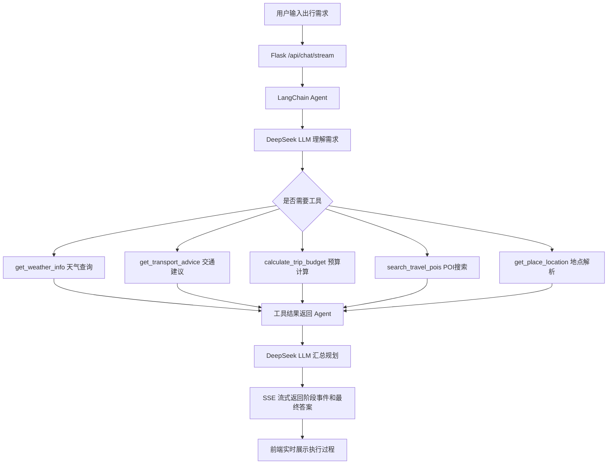

# LangChain 旅游出行规划智能体

这是一个围绕“智能体架构与开发流程”实验要求完成的课程项目。项目基于 Python、Flask、LangChain 和 DeepSeek API，实现了一个旅游出行规划 Agent。它可以理解用户需求、拆解任务、调用 LLM、按需调用外部工具、汇总工具结果，并通过网页界面输出完整行程方案。

项目参考了本地下载网页《【LangChain+文心大模型】构建旅游出行规划智能体 - 飞桨AI Studio星河社区》，但当前实现已经扩展为带 Web UI、多轮会话持久化和流式工具调用可视化的版本。

## 当前状态

已完成：

- LangChain Agent 主流程
- DeepSeek OpenAI-compatible API 接入
- 普通模式使用 `deepseek-v4-flash`
- 深度思考模式使用 `deepseek-v4-pro`
- 天气查询、预算计算、交通建议 3 个外部工具
- Flask Web 聊天界面
- Markdown 渲染为标题、列表、表格
- SQLite 服务端历史会话持久化
- 刷新页面后恢复历史聊天
- 流式 Agent 执行过程展示
- 运行中自动展开执行过程，完成后自动折叠
- 执行过程显示每步状态、相对时间、耗时和异常高亮
- 生成中可点击“停止”中断当前前端请求
- 支持导出 Agent 执行报告 JSON
- 每轮回复保存模型、模式、耗时和 trace 元数据
- **结构化 JSON 输出 + 前端卡片渲染**（v2.0 新增）：Agent 在 Markdown 末尾输出 JSON 代码块，后端提取为 `structured_data`，前端渲染为天气卡片、每日行程时间轴、交通方案卡、预算明细卡和出行提示列表；原始 JSON 不直接展示给用户

当前适合：

- 课程实验验收
- 本地演示 LangChain Agent 工作流
- 继续扩展成简历项目

## 项目目标

实验要求中的智能体闭环：

```text
理解需求 -> 拆解任务 -> 调用 LLM 思考 -> 选择工具 -> 执行工具 -> 汇总结果 -> 输出规划
```

本项目对应实现：

- 用户输入自然语言出行需求。
- LLM 判断目的地、出发地、天数、人数、预算和偏好。
- Agent 自主决定是否调用天气、交通、预算工具。
- 工具返回后，LLM 汇总生成中文旅行规划。
- 前端实时展示 Agent 运行阶段，让用户知道请求已经发出、模型正在工作、工具是否被调用。

## 技术栈

- 编程语言：Python
- 本机解释器：`C:\Users\BaoXinJie\anaconda3\python.exe`
- Web 框架：Flask
- 智能体框架：LangChain
- LLM 接入：`langchain-openai` 的 OpenAI-compatible 接口
- 模型平台：DeepSeek
- 前端：原生 HTML、CSS、JavaScript
- 历史记录：SQLite
- 流式通信：SSE，接口为 `/api/chat/stream`

选择 Python 的原因：LangChain 的 Python 生态最成熟，Agent、工具封装、模型接入和实验资料都更完整。

## 项目结构

```text
.
├── app.py                         # Flask 启动入口，导入 web.py 中的 app
├── web.py                         # Flask 路由、聊天接口、SSE 流式接口
├── run.py                         # 命令行入口
├── requirements.txt               # Python 依赖
├── .env.example                   # 环境变量模板
├── README.md                      # 当前说明文档
├── EXPERIMENT_REPORT.md           # 实验报告草稿/说明
├── data/
│   └── travel_agent.db            # SQLite 数据库，运行后自动生成
├── static/
│   ├── app.js                     # 前端交互、SSE 读取、Markdown 渲染、历史会话
│   └── styles.css                 # 页面样式
├── templates/
│   └── index.html                 # Web 页面模板
└── src/
    └── travel_agent/
        ├── __init__.py
        ├── agent.py               # LangChain Agent、提示词、trace 提取、流式事件
        ├── cli.py                 # CLI 参数解析
        ├── config.py              # .env 配置读取
        ├── storage.py             # SQLite 会话和消息持久化
        └── tools.py               # 天气、预算、交通、POI、地点解析工具
```

## 环境配置

推荐使用用户本地 PyCharm 同款解释器：

```powershell
C:\Users\BaoXinJie\anaconda3\python.exe
```

安装依赖：

```powershell
C:\Users\BaoXinJie\anaconda3\python.exe -m pip install -r requirements.txt
```

复制环境变量模板：

```powershell
Copy-Item .env.example .env
```

`.env` 需要包含：

```text
LLM_API_KEY=你的 DeepSeek API Key
LLM_BASE_URL=https://api.deepseek.com
LLM_MODEL=deepseek-v4-flash
LLM_THINKING_MODEL=deepseek-v4-pro
LLM_TEMPERATURE=0.3
LLM_TIMEOUT=90
AMAP_API_KEY=你的高德地图 Web 服务 Key
QWEATHER_API_KEY=你的和风天气 API Key
QWEATHER_API_HOST=你的和风天气专属 API Host
```

注意：`.env` 不应提交到公开仓库。和风天气当前需要在控制台-设置中复制专属 API Host；如果暂时没有填写 `QWEATHER_API_HOST`，项目会自动使用高德天气或 Open-Meteo 回退。

## 运行方式

启动 Web 界面：

```powershell
C:\Users\BaoXinJie\anaconda3\python.exe app.py
```

浏览器打开：

```text
http://127.0.0.1:5000
```

命令行普通模式：

```powershell
C:\Users\BaoXinJie\anaconda3\python.exe run.py -q "我明天从郑州去杭州，玩3天，2个人，酒店300，餐饮120，门票300"
```

命令行深度思考模式：

```powershell
C:\Users\BaoXinJie\anaconda3\python.exe run.py --thinking -q "我明天从郑州去杭州，玩3天，2个人，酒店300，餐饮120，门票300"
```

离线演示模式：

```powershell
C:\Users\BaoXinJie\anaconda3\python.exe run.py --offline-demo -q "我明天从郑州去杭州，玩3天"
```

离线演示不调用 LLM，只用于验证工具链和页面流程。正式展示建议关闭离线演示，使用真实 DeepSeek API。

## Web 功能说明

页面包含：

- 左侧运行状态：普通模型、思考模型、API Key 状态
- 左侧历史会话：新建、切换、删除
- 主聊天区：用户输入和助手回复
- 输入区开关：深度思考、离线演示
- 回复下方元信息：模式、模型、耗时
- 回复下方执行过程：工具调用 trace

当前 UI 的重点不是华丽，而是让用户清楚看到 Agent 确实在运行：

- 请求刚发出时显示“请求已接收”
- 模型启动时显示使用的模型
- 调用工具时实时显示工具名和参数
- 工具返回后显示结果摘要
- 模型阶段完成时显示 token usage
- trace 中展示每个阶段的 `running` / `success` / `error` 状态
- 工具调用返回后展示该步骤耗时，异常结果会高亮
- 运行中 trace 自动展开
- 最终回答生成后 trace 自动折叠
- 生成过程中发送按钮会变为“停止”，可中断当前前端流式请求
- 历史回复中的 trace 可导出为 JSON 执行报告

## Agent 架构



## 核心模块说明

### `src/travel_agent/agent.py`

负责：

- 构建 LangChain Agent
- 定义系统提示词
- 区分普通模式和深度思考模式
- 构建多轮消息上下文
- 从历史消息中提取轻量记忆摘要
- 非流式运行：`run_agent_with_trace`
- 流式运行：`stream_agent_events`
- 提取工具调用 trace

重要设计：

- 普通模式使用 `.env` 的 `LLM_MODEL`
- 深度思考模式使用 `.env` 的 `LLM_THINKING_MODEL`
- 用户询问模型身份时，提示词要求按当前配置回答，避免模型自称 Claude 等无关身份
- DeepSeek API-level thinking 被关闭，原因见下文“重要注意事项”

### `src/travel_agent/tools.py`

当前工具：

- `get_weather_info(city, date)`：优先调用和风天气；未配置和风 API Host 时使用高德天气；再失败时回退 Open-Meteo
- `get_transport_advice(origin, destination)`：优先调用高德地图解析路线距离、驾车耗时和费用估算；失败时生成通用交通建议
- `calculate_trip_budget(...)`：按人数、天数、酒店、餐饮、门票计算预算
- `search_travel_pois(city, keyword, limit)`：调用高德地图搜索景点、餐饮、商圈、酒店等 POI
- `get_place_location(place, city)`：调用高德地图核验地点地址和经纬度

工具会在控制台输出调用日志，便于实验展示和调试。

### `src/travel_agent/storage.py`

负责 SQLite 持久化：

- `conversations` 表保存会话
- `messages` 表保存用户和助手消息
- `meta_json` 保存模型、模式、耗时、trace

数据库路径：

```text
data/travel_agent.db
```

### `web.py`

主要接口：

- `GET /`：页面
- `GET /api/status`：读取模型和 API Key 状态
- `GET /api/conversations`：会话列表
- `GET /api/conversations/<id>/messages`：读取会话消息
- `DELETE /api/conversations/<id>`：删除会话
- `POST /api/chat`：非流式聊天接口，保留兼容
- `POST /api/chat/stream`：当前前端使用的 SSE 流式聊天接口

### `static/app.js`

负责：

- 发送用户消息
- 读取 SSE 流式事件
- 实时更新 loading 消息
- 渲染 Markdown
- 渲染 trace 折叠面板
- 维护当前 `conversation_id`
- 加载、切换、删除历史会话

## 深度思考模式说明

用户原始理解是：深度思考模式应该让智能体“思考更长时间再回答”。

当前实现方式：

- 普通模式：`deepseek-v4-flash`
- 深度思考模式：`deepseek-v4-pro`
- 深度思考提示词要求模型更充分地分析需求、检查约束、选择工具

重要：当前没有开启 DeepSeek API-level thinking。

原因：DeepSeek V4 的 API-level thinking 在工具调用场景下会返回 `reasoning_content`。一旦发生 tool call，后续请求必须把 `reasoning_content` 原样传回 API，否则会报错：

```text
The `reasoning_content` in the thinking mode must be passed back to the API.
```

当前 LangChain OpenAI-compatible 工具 Agent 不会自动维护这个字段，所以项目在 `ChatOpenAI` 中设置：

```python
extra_body={"thinking": {"type": "disabled"}}
```

也就是说：

- “深度思考模式”目前是 Pro 模型 + 提示词层面的深度规划
- 不是 DeepSeek API 原生 thinking
- 这样做是为了保证工具调用链稳定

## 流式工具调用可视化

当前已完成较完善的流式可视化。

后端 `stream_agent_events` 会产出事件：

- `status`：请求接收、模型启动、开始分析
- `trace`：工具调用、工具返回、模型阶段完成
- `final`：Agent 最终答案
- `done`：后端保存结果后返回最终完整数据
- `error`：异常信息

前端展示策略：

- 请求进行中：trace 面板展开
- 每收到一个阶段事件：更新状态文本和 trace 列表
- 回复完成后：删除 loading 消息，渲染最终助手消息
- 最终助手消息中的 trace 默认折叠
- 用户可以手动展开历史 trace

这个功能用于解决“用户不知道请求是否发出去、Agent 是否真的在思考”的问题。

## 多轮对话记忆

当前实现是轻量级多轮记忆：

- 前端保存当前 `conversation_id`
- 后端用 SQLite 作为历史消息源
- 每轮只传最近部分历史，避免 token 膨胀
- Agent 会从历史中提取摘要，例如：
  - 最近出发地
  - 最近目的地
  - 天数
  - 人数
  - 预算数字
  - 偏好关键词

刷新页面后，前端会自动恢复上次会话。

## 输出风格控制

系统提示词要求：

- 使用规范 Markdown
- 标题最多使用二级、三级标题
- 不滥用 `#`、`*`、分割线等装饰符号
- 表格列数控制在 4 列以内
- 少用 emoji
- 不在结尾输出泛泛的推销式追问

前端会将 Markdown 渲染成真实 HTML 标题、列表和表格，避免纯字符表格难看、不对齐的问题。

## 和传统固定流程的区别

传统固定流程通常写死：

```text
先查天气 -> 再算预算 -> 再套模板输出
```

本项目使用 LangChain Agent：

- 由 LLM 判断用户需求
- 由 LLM 决定是否调用工具
- 由 LLM 决定调用哪些工具
- 工具结果返回后再由 LLM 综合生成答案

因此它更符合智能体“自主任务拆解 + 工具调用 + 结果汇总”的实验要求。

## 重要注意事项

1. 不要把 `.env` 或真实 API Key 提交到公开仓库。
2. 如果 DeepSeek 控制台没有请求记录，先确认前端没有开启“离线演示模式”。
3. 如果问“你是什么模型”却回答 Claude，优先检查 `agent.py` 中身份提示词是否被改坏。
4. 不建议直接开启 DeepSeek API-level thinking，除非接手者能处理 `reasoning_content` 的多轮回传。
5. 天气工具依赖 Open-Meteo 网络接口，没网或接口失败时会返回异常文本，Agent 会继续整合结果。
6. 当前 Flask 是开发服务器，只适合本地演示，不是生产部署。

## 常用验证命令

Python 编译检查：

```powershell
C:\Users\BaoXinJie\anaconda3\python.exe -m compileall app.py web.py run.py src
```

前端语法检查：

```powershell
node --check static/app.js
```

状态接口检查：

```powershell
Invoke-WebRequest -UseBasicParsing http://127.0.0.1:5000/api/status
```

SSE 离线接口快速检查：

```powershell
C:\Users\BaoXinJie\anaconda3\python.exe -c "from web import app; c=app.test_client(); r=c.post('/api/chat/stream', json={'message':'宁波到舟山1天','offline_demo':True}); print(r.status_code); print(r.get_data(as_text=True)[:500])"
```

## 后续优化路线

### 1. 结构化输出与前端卡片渲染

当前已完成 Phase 1：模型输出 JSON，后端提取 `structured_data`，前端渲染基础卡片。下一步适合继续增强为更稳定的结构化输出系统，例如增加 Schema 校验、字段容错、卡片交互和更丰富的产品化布局。

建议结构：

```json
{
  "summary": "...",
  "weather": [],
  "transport_options": [],
  "daily_itinerary": [],
  "budget": {},
  "tips": []
}
```

可以渲染为：

- 天气卡片
- 每日行程时间轴
- 交通方案对比
- 预算明细卡
- 注意事项列表

这是最适合继续打磨简历项目的方向，因为它能体现“LLM 结构化输出 + 前端工程化渲染”。

### 2. 更完整的 Agent 运行时间轴

当前已完成 Phase 2 的基础版本：流式 trace 已增强为可观察的运行时间轴：

- 每一步开始时间、结束时间、耗时
- 工具状态：运行中、成功、异常
- 错误步骤高亮
- 支持用户中断当前生成任务
- 支持导出 Agent 运行报告

后续还可以继续扩展为更专业的观测面板，例如给每个步骤分配稳定 step id、展示更细的 LLM 首 token 时间、保存用户主动中断记录、支持 Markdown/PDF 版运行报告。

### 3. 更多工具

可扩展：

- 景点/POI 推荐
- 地图距离和通勤时间
- 节假日判断
- 汇率工具
- 酒店/餐饮 mock 数据
- 本地旅行知识库 RAG

即使不接真实付费 API，也可以先设计接口和 mock 数据。

### 4. 用户偏好系统

可以增加偏好面板：

- 旅行风格：轻松、紧凑、亲子、美食、文化、自然风光
- 预算等级：经济、舒适、高端
- 出行方式：公共交通、自驾、打车
- 作息偏好：早起、正常、慢节奏
- 饮食偏好：本地特色、清淡、重口、素食

Agent 根据偏好调整路线和推荐。

### 5. 测试与工程化

建议补充 `pytest`：

- 配置读取测试
- 预算工具测试
- 天气工具 mock 测试
- Flask `/api/status` 测试
- Flask `/api/chat/stream` 离线模式测试
- storage SQLite 测试

工程化方向：

- 增加 `tests/`
- 增加 `pyproject.toml`
- 增加 Dockerfile
- 增加截图和 Demo 文档
- 增加部署说明

## 简历表达参考

可以写成：

> 基于 LangChain 和 DeepSeek 的智能旅行规划 Agent，支持多轮对话、工具调用、天气查询、预算计算、交通建议和流式执行过程可视化。系统使用 Flask 提供 Web 交互界面，通过 SSE 实时展示 Agent 的工具调用阶段，并用 SQLite 持久化历史会话和每轮 trace。v2.0 新增结构化 JSON 输出，前端渲染为天气卡片、行程时间轴、交通方案卡、预算明细卡和出行提示列表，实现从 LLM 文本到产品化 UI 卡片的完整链路。项目支持普通模式与深度规划模式切换，完整体现”需求理解、任务拆解、工具调用、结果汇总”的智能体工作流。

## 建议接手顺序

1. 先阅读 `src/travel_agent/agent.py`，理解 Agent、提示词、trace、流式事件产出，以及 **JSON 提取函数**（`extract_structured_json` / `strip_structured_json` / `_find_json_fence_pairs`）。
2. 再阅读 `web.py`，理解 `/api/chat/stream` 如何保存消息、转发 `structured_data` 并流式返回。
3. 再阅读 `static/app.js`，理解前端 SSE 解析、Markdown 渲染以及 **卡片渲染函数**（`renderStructuredCardsInto` / `renderWeatherCards` / `renderItineraryTimeline` 等）。
4. 再阅读 `storage.py` 和 `tools.py`，理解持久化和工具实现。
5. Phase 1 和 Phase 2 基础能力已经完成。下一步优先做 **Phase 3：更多外部工具与真实数据源**，例如 POI 推荐、地图距离、节假日判断或本地旅行知识库 RAG。

## v2.0 结构化输出系统说明（Phase 1 已完成）

这是 2026-05-14 完成的 Phase 1 改进。后续接手者应理解以下数据流：

### 数据流

```
LLM 回答末尾的 ```json 代码块
  → agent.py: extract_structured_json() 提取为 dict
  → agent.py: strip_structured_json() 从 Markdown 中移除 JSON 块
  → agent.py: stream_agent_events() 的 final 事件 yield structured_data
  → web.py: SSE generate() 转发 structured_data 到 done 事件
  → web.py: 将 structured_data 持久化到 messages.meta_json
  → app.js: 收到 done 事件后调用 renderStructuredCardsInto()
  → app.js: buildStructuredCards() 根据 schema 渲染对应卡片
```

### 新增关键函数

**后端（agent.py）**：
- `_find_json_fence_pairs(text)` — 查找所有 ```json 代码块位置，处理嵌套 JSON
- `extract_structured_json(text)` — 从文本中提取旅行规划 JSON，通过已知 key 集合验证
- `strip_structured_json(text)` — 移除 JSON 代码块，避免 Markdown 渲染原始 JSON
- `run_offline_demo()` 也产出结构化 JSON，离线演示用户可见卡片

**后端（web.py）**：
- `/api/chat/stream` SSE done 事件新增 `structured_data` 字段
- `/api/chat` 非流式接口同步返回 `structured_data`
- 消息持久化时 `meta_json` 包含 `structured_data`

**前端（app.js）**：
- `renderStructuredCardsInto(article, data)` — 入口：将卡片注入消息气泡
- `buildStructuredCards(data)` — 根据数据字段分发渲染
- `renderWeatherCards(weatherList)` — 天气卡片网格
- `renderItineraryTimeline(itinerary)` — 每日行程时间轴
- `renderTransportCards(transportList)` — 交通方案卡
- `renderBudgetCard(budget)` — 预算明细卡
- `renderTipsList(tips)` — 出行提示列表

**前端（styles.css）**：
- `.structured-container` / `.card-section` / `.card-section-title` — 卡片布局基础
- `.weather-card` / `.weather-card-grid` — 天气卡片样式
- `.timeline` / `.timeline-item` / `.timeline-marker` — 时间轴样式
- `.transport-card` / `.transport-grid` — 交通方案卡样式
- `.budget-card` / `.budget-row` / `.budget-total` — 预算卡样式
- `.tips-list` / `.tips-item` / `.tips-num` — 提示列表样式

### JSON Schema

```json
{
  "summary": "行程整体概述（字符串）",
  "weather": [{"city": "", "date": "", "temperature": "", "condition": "", "humidity": "", "wind": ""}],
  "transport_options": [{"mode": "", "from": "", "to": "", "duration": "", "cost_estimate": "", "notes": ""}],
  "daily_itinerary": [{"day": 1, "title": "", "activities": [], "meals": [], "accommodation": ""}],
  "budget": {"total": 0, "breakdown": {}, "currency": "CNY", "notes": ""},
  "tips": []
}
```

### 向后兼容

- LLM 未产出 JSON 或 JSON 不合法 → `extract_structured_json` 返回 `None`，前端不渲染卡片，回退到纯 Markdown
- 历史消息 `meta_json` 没有 `structured_data` → 不渲染卡片
- 离线演示模式同样产出 JSON，卡片正常渲染
